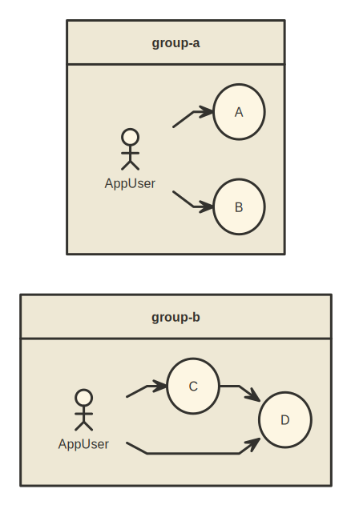

# almin-usecase-map-generator [](https://travis-ci.org/azu/almin-usecase-map-generator)


Command line tool that generate UseCase map from almin's UseCases.



## Install

Install with [npm](https://www.npmjs.com/):

    npm install almin-usecase-map-generator

## Usage

    Usage
      $ almin-usecase-map-generator "[glob*]"
    
    Options
      --output  output path
      --format  "nomnoml" | "svg" | "url" (default: "svg")
    
    Examples
      $ almin-usecase-map-generator "src/use-case/**/*.js"


## Structure of UseCase

For example, [Faao](https://github.com/azu/faao "Faao").

- UseCase
    - Group/
        - UseCase files

Result: <https://azu.github.io/faao/meta/use-case.html>

```
✈ tree
UseCase
├── App
│   ├── AppUserOpenGitHubUserCase.ts
│   ├── AppUserOpenGitHubUserEventUseCase.ts
│   ├── AppUserOpenItemUseCase.ts
│   ├── AppUserOpenStreamUseCase.ts
│   ├── AppUserSelectFirstItemUseCase.ts
│   ├── AppUserSelectItemUseCase.ts
│   ├── AppUserSelectNextItemUseCase.ts
│   ├── AppUserSelectPrevItemUseCase.ts
│   ├── OpenItemInNewTabUseCase.ts
│   ├── UpdateAppNetworkStatusUseCase.ts
│   └── UpdateQueryToSearchListUseCase.ts
├── DomainConnection
│   ├── GItHubSettingToGitHubUser.ts
│   └── README.md
├── GitHubSearchList
│   ├── AddSearchListUseCase.ts
│   ├── DeleteQueryUseCase.ts
│   ├── SaveQueryToSearchListUseCase.ts
│   ├── SearchQueriesAndOpenStreamUseCase.ts
│   ├── SearchQueriesAndUpdateStreamUseCase.ts
│   ├── SearchQueryAndOpenStreamUseCase.ts
│   ├── SearchQueryToUpdateStreamUseCase.ts
│   ├── ToggleQueryPanelUseCase.ts
│   └── ToggleSearchListPanelUseCase.ts
├── GitHubSearchStream
│   ├── ApplyFilterToCurrentStreamUseCase.ts
│   ├── ReloadActiveStreamUseCase.ts
│   └── ReloadAllStreamUseCase.ts
├── GitHubSetting
│   ├── CheckGrantGitHubAPIUseCase.ts
│   ├── DeleteSettingUseCase.ts
│   ├── SaveGitHubSettingUseCase.ts
│   ├── ToggleSettingPanelUseCase.ts
│   └── __tests__
│       └── ToggleSettingPanelUseCase-test.ts
├── GitHubUser
│   ├── ApplyFilterToCurrentUserActivityUseCase.ts
│   ├── FetchGitHubUserActivityUseCase.ts
│   ├── FetchGitHubUserDataUserCase.ts
│   └── ReloadCurrentUserActivityUseCase.ts
├── Mobile
│   └── ToggleMobileMenuUseCase.ts
├── Notice
│   ├── DismissErrorNoticeUseCase.ts
│   ├── ShowErrorNoticeUseCase.ts
│   ├── ShowGenericErrorUseCase.ts
│   └── __tests__
│       ├── DismissErrorNoticeUseCase-test.ts
│       └── ShowErrorNoticeUseCase-test.ts
├── Profile
│   ├── ExportProfileUseCase.ts
│   ├── ImportProfileJSONUseCase.ts
│   ├── ToggleProfileWindowUseCase.ts
│   └── __tests__
│       ├── ExportProfileUseCase-test.ts
│       └── ImportProfileJSONUseCase-test.ts
├── QuickIssue
│   ├── CloseQuickIssueUseCase.ts
│   ├── OpenGitHubIssueUseCase.ts
│   └── OpenQuickIssueUseCase.ts
└── System
    ├── ClearAllStorageUseCase.ts
    ├── ClearCacheDataUseCase.ts
    └── SystemReadyToLaunchAppUseCase.ts

```

## Changelog

See [Releases page](https://github.com/almin/almin-usecase-map-generator/releases).

## Running tests

Install devDependencies and Run `npm test`:

    npm i -d && npm test

## Contributing

Pull requests and stars are always welcome.

For bugs and feature requests, [please create an issue](https://github.com/almin/almin-usecase-map-generator/issues).

1. Fork it!
2. Create your feature branch: `git checkout -b my-new-feature`
3. Commit your changes: `git commit -am 'Add some feature'`
4. Push to the branch: `git push origin my-new-feature`
5. Submit a pull request :D

## Author

- [github/azu](https://github.com/azu)
- [twitter/azu_re](https://twitter.com/azu_re)

## License

MIT © azu
